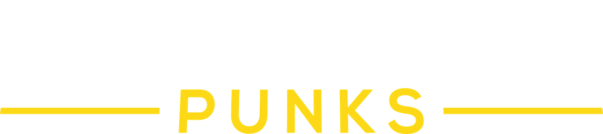

Repo der Website der **lastLAN** – der LAN-Party von **Sissi State Punks (SSP)**.
Entwickelt auf Basis des [DoT-LAN-Forks](https://github.com/mrhund/KLMS-for-DoT)
des [KRRU LAN-Party Management Systems (KLMS)](https://github.com/KRRUg/klms).

> **Wichtig:** Dieses Projekt basiert auf dem DoT-LAN-Fork von KRRU-KLMS.
> Wir bauen unsere Arbeit auf diesem Fork auf und machen das immer sichtbar —
> der Ursprung bleibt auch in Zukunft erkennbar und verlinkt.

Dieses Repository dient als Frontend- und Content-Plattform für die aktuelle
sowie kommende Veranstaltungsausgabe der lastLAN.

---

## Über das Projekt

Dieses Repository enthält die Web-Instanz der **lastLAN**, der LAN-Party des
Vereins **Sissi State Punks (SSP)** in Österreich.
Die Seite bietet Informationen rund um das Event, Sponsoren, Turniere, Tickets
und aktuelle News.

Die technische Grundlage stammt vom **DoT-LAN-Fork**
([`mrhund/KLMS-for-DoT`](https://github.com/mrhund/KLMS-for-DoT)) des
**[KRRU LAN-Party Management Systems](https://github.com/KRRUg/klms)**,
der von uns an das Branding, die Inhalte und Abläufe der lastLAN angepasst wurde.

---

## Features

KLMS bietet:
- **Event-Präsentation** – News, Sponsoren, Turniere, Teamvorstellungen und mehr, alles in einem modernen Design.
- **Anmeldung & Tickets** – Direkte Registrierung und Ticketbuchung für Teilnehmer:innen.
- **Sitzplan** – Intuitive Sitzplatzwahl direkt auf der Website.
- **Turnierverwaltung** – Übersicht über alle Wettbewerbe, Anmeldungen und Ergebnisse.
- **Community & Partnerseiten** – Vorstellung unserer Streamer, Sponsoren und Partner.
- **Newsletter-System** – Immer auf dem Laufenden bleiben über aktuelle News und Aktionen.

Es wurde von uns erweitert um:

- **Clan-Discount** – Die Möglichkeit bei Clans einen speziellen Preis zu hinterlegen.
- **SumUp Integration** – Zahlungsfunktion via **[SumUp](https://www.sumup.com)**.
- **Bildergalerie** – Bilder von vergangenen Veranstaltungen anzeigen.
- **FAQ** – Erstellen und bearbeiten von FAQs inkl. Suche.
- **QR-Code CheckIn** – Erstellen und Versenden eines QR-Codes (Ticket), der beim Check-In verifiziert werden kann.
- **News Kommentare** – Kommentieren von News Beiträgen
- **Profile Pictures** – Profilbilder, die auf der gesamten Seite angezeigt werden.
- **Community Polls** – Umfragen für die Community.
- **Turnier Gruppenphase** - Gruppenphase vor Single- bzw. Double Elimination Turnieren
- **User-Map** - Anonymisierte Anzeige der Orte, woher die Personen kommen.
- **Beamer-News** - Anzeige von News auf der LAN auf dem Beamer mittels RSS-Feed.

---

## Technologie

Basierend auf dem **Symfony Framework** und **Bootstrap**.
Daten und Logik stammen aus dem KRRU-Kernsystem (via DoT-LAN-Fork).

---

## Herkunft & Lizenz

Dieses Projekt basiert auf dem **[KRRU LAN-Party Management System (KLMS)](https://github.com/KRRUg/klms)**
über den **[DoT-LAN-Fork](https://github.com/mrhund/KLMS-for-DoT)**
und steht wie die Originalwerke unter der [GPLv3 Lizenz](LICENSE).

---

## Mitwirkende

- **Sissi State Punks (SSP)** – Veranstalter der lastLAN
- **DoT-LAN / LANBUDDYs** – Basis-Fork, auf dem unsere Arbeit aufbaut
- **KRRU Team** – Entwickler und Maintainer des ursprünglichen Systems
- **Community & Partner** – Unterstützung durch Sponsoren, Streamer und Gamer:innen

---

<em>Wir sehen uns auf der lastLAN!</em>

